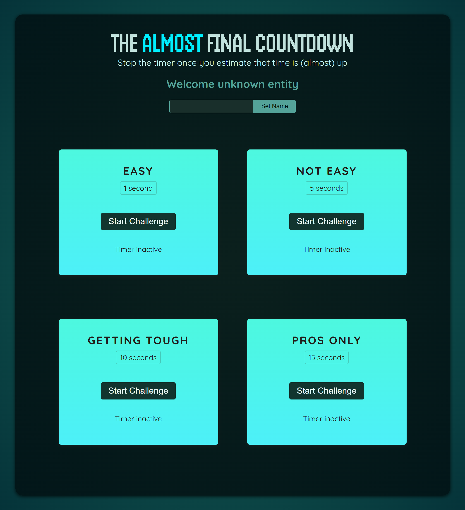

#Timer-Challenge

<h2>📸 Screenshot</h2>

<em>A preview of Timer-Challenge game</em>

<h2>🕹️ How to Play</h2>
<ul>
    <li>Enter your name in the input field and click <strong>Set Name</strong>.</li>
    <li>Choose a challenge level:
        <ul>
            <li><strong>Easy</strong> (1 second)</li>
            <li><strong>Not Easy</strong> (5 seconds)</li>
            <li><strong>Getting Tough</strong> (10 seconds)</li>
            <li><strong>Pros Only</strong> (15 seconds)</li>
        </ul>
    </li>
    <li>Click <strong>Start Challenge</strong> to begin the countdown.</li>
    <li>Once you estimate that the target time has elapsed, click to stop the timer.</li>
    <li>Your accuracy is measured based on how close you are to the target time.</li>
</ul>

<h2>🛠️ Technologies Used</h2>
<ul>
    <li><strong>HTML, CSS, JavaScript</strong> for the frontend</li>
    <li><strong>React.js</strong> for dynamic UI interactions</li>
    <li><strong>CSS</strong> for styling</li>
</ul>

<h2>🚀 Features</h2>
<ul>
    <li>Different difficulty levels to challenge players</li>
    <li>User-friendly interface with a futuristic countdown theme</li>
    <li>Real-time feedback on your timing accuracy</li>
    <li>Customizable player name for a personalized experience</li>
</ul>

<h2>🔧 Installation & Running Locally</h2>

Follow these steps to set up the project on your local machine:

<pre>
    git clone https://github.com/yourusername/Timer-Challenge.git
    cd Timer-Challenge
    npm install
    npm start
</pre>

Open the game in your browser at <code>http://localhost:3000</code>

<h2>🤝 Contributing</h2>

We welcome contributions! If you’d like to improve the game or add new features:

<ol>
    <li><strong>Fork</strong> the repository.</li>
    <li><strong>Create a new branch</strong> (<code>git checkout -b feature-name</code>).</li>
    <li><strong>Commit your changes</strong> (<code>git commit -m 'Added new feature'</code>).</li>
    <li><strong>Push to the branch</strong> (<code>git push origin feature-name</code>).</li>
    <li><strong>Open a pull request</strong> and describe your changes.</li>
</ol>

<h2>📝 License</h2>

This project is licensed under the MIT License.

